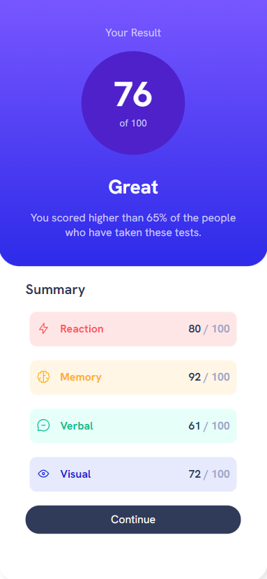

# Frontend Mentor - Results summary component solution

This is a solution to the (https://www.frontendmentor.io/challenges/results-summary-component-CE_K6s0maV).

## Table of contents

- [Overview](#overview)
  - [The challenge](#the-challenge)
  - [Screenshots](#screenshots)
  - [Links](#links)
- [My process](#my-process)
  - [What I learned](#what-i-learned)
  - [Possible upgrades](#possible-upgrades)

## Overview

### The challenge

The challenge concerned building out this results summary component and getting it as close to the design as possible. I upgraded it by adding smooth animation of total score display.

### Screenshots

### Links

Solution URL: 
    https://rafalbodanka.github.io/results-summary-component/

## My process

### What I learned

During this challenge, I learned how to work with styling a webpage for mobile devices and animating the display of points on the screen at a decreasing pace.

### Possible upgrades

 - Ranking view based on total score or particular ability e.g. memory.
 - On hover descriptive summary for every ability.

